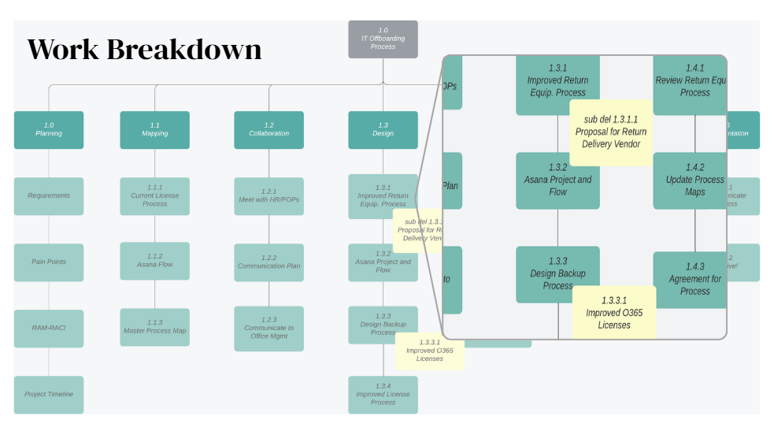
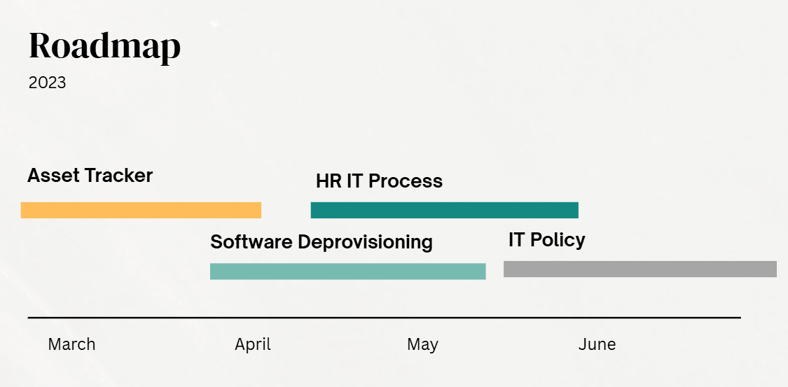
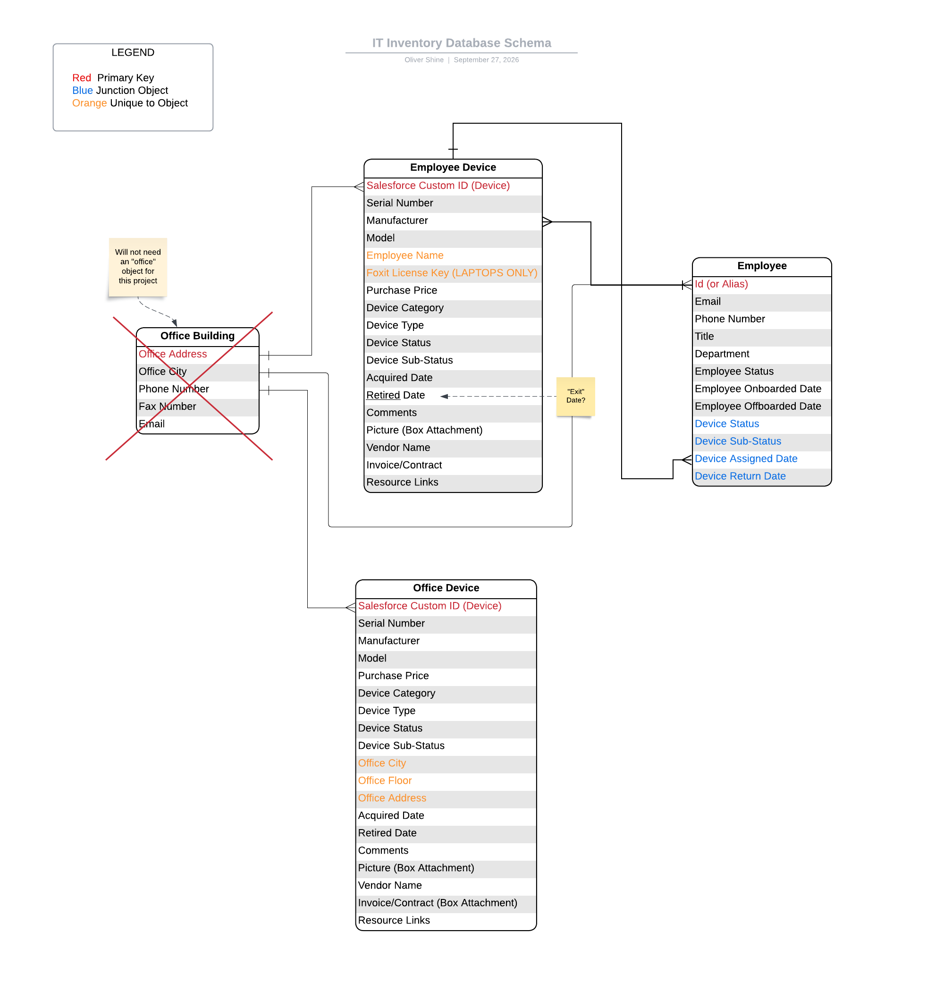

# Case Study: IT Offboarding Process

## Pain Points
- Inconsistant software deprovisioning (potential security risk)
- Missing returned hardware from offboarded staff from 
   ~5 employees per month (cost to company)
- Increase workload on IT to track and retrieve and manually offboard users
- Lack of standardized and documented process

## Methodology
### Project Plan and Work Breakdown Structure
- I generated the project plan with the initiatives and deliverables to accomplish
- In this Work Breakdown Structure, I visualize and document the deliverables and sub deliverables
- I broke down the deliverables into subtasks that informed the project timeline
 

### Roadmap and Timelines
- Based on the scope and deliverables, I generated a high level roadmap for accomplishing each initiative
- In Asana, I documented the tasks and subtasks with detailed timelines and responsible stakeholders

### Design
- During the project execution and design stage, I worked with IT to draft a data structure
  that meets IT and the company's high-priority requirements and is technically capable to build
- *Example:* Here is a sample draft for designing the IT asset tracker in the company CRM

### Solutions

